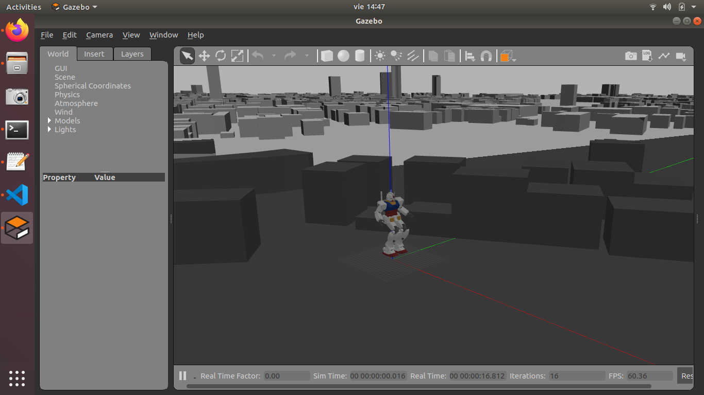

Examen Semestral Sistemas Expertos: Gundam en la Ciudad de Panamá
===========================




Integrantes
-----------
Jonathan Gantes -
 Julissa Grajales -
 Sergio Aizprua.

Como Visualizar el modelo URDF
------------------------------

Para visualizar el modelo en rviz, usaremos el archivo `display.launch`.
```
$ roslaunch gundam_rx78_description display.launch
```

Como correr el Gundam en una simulación de Gazebo
-------------------------------------------------
Para correr la simulación en el mundo vacío podemos lanzar el archivo `gundam_rx78_world.launch`.

```
$ roslaunch gundam_rx78_gazebo gundam_rx78_world.launch
```

Para correr la simulación en el mundo de la Ciudad de Panamá podemos lanzar el archivo `gundam_rx78_panama.launch`.

```
$ roslaunch gundam_rx78_gazebo gundam_rx78_panama.launch
```

Como mover el Gundam en cualquier dirección
---------------------------

Para hacer que el Gundam Camine, debe estar ejecutandose la simulación de gazebo del paso anterior y luego en una nueva consola ejecutar cualquiera de los siguientes comandos:

Solo ejecutar una vez:
```
#cd al ambiente del proyecto
#Ejecutar una vez el siguiente comando
$ source devel/setup.bash
```

```
#Comandos para paso en cualquier dirección
# Un paso
$ rosrun gundam_rx78_control joint_trajectory_client_csv.py `rospack find gundam_rx78_control`/sample/csv/step.csv
# Caminar al Frente
$ rosrun gundam_rx78_control joint_trajectory_client_csv.py `rospack find gundam_rx78_control`/sample/csv/walk-forward.csv
# Caminar Atras
$ rosrun gundam_rx78_control joint_trajectory_client_csv.py `rospack find gundam_rx78_control`/sample/csv/walk-backward.csv
# Caminar a la Derecha
$ rosrun gundam_rx78_control joint_trajectory_client_csv.py `rospack find gundam_rx78_control`/sample/csv/walk-to-right.csv
# Caminar a la Izquierda
$ rosrun gundam_rx78_control joint_trajectory_client_csv.py `rospack find gundam_rx78_control`/sample/csv/walk-to-left.csv
# Girar a la Derecha
$ rosrun gundam_rx78_control joint_trajectory_client_csv.py `rospack find gundam_rx78_control`/sample/csv/turn-right.csv
# Girar a la izquierda
$ rosrun gundam_rx78_control joint_trajectory_client_csv.py `rospack find gundam_rx78_control`/sample/csv/turn-left.csv
```

Para desarolladores:
===================

Como Instalar:
----------------------

Es comentable utilizar `wstool` para instalar y configurar el ambiente;

```
$ mkdir -p catkin_ws/src
$ cd  catkin_ws
$ wstool init src
$ wstool merge -t src https://raw.githubusercontent.com/gundam-global-challenge/gundam_robot/.gundam.rosinstall
$ wstool update -t src
$ source /opt/ros/$ROS_DISTRO/setup.bash
$ rosdep install -y -r --from-paths src --ignore-src
$ catkin build
$ source devel/setup.bash
```

Configuraciones adicionales:
---------------------
Ir al archivo `gundam_rx78_gazebo/worlds/gundam_rx78_panama.world` y cambiar la ruta del archivo panama.dae a la ruta de tu computadora.
